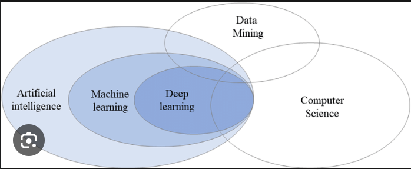

# FOUNDATION

## INTRO
- 
- 50% of ML is SE.
- ML- coding,DSA,SystemEngineering
      oops concepts,encapsulation,inheritance,polymorphism

## Python Basics
- data types,flow control,functions,oops,file handling
- how to use in different platforms
- covered in the first week

## Python for data science
- used in cloud for automation
- used in web development like flask,django for back end applications
- used in games like pygame library 
- used in building interfaces

## ML
- we load the data
- library to load the data
- library to analyse the data
- library to visualize the data
- pandas 
- numpy
- data visualization tools like 
  - matplotlib:
    - Matplotlib is a powerful tool for executing a variety of tasks. It is able to create different types of visualization reports like line plots, scatter plots, histograms, bar charts, pie charts, box plots, and many more different plots. This library also supports 3-dimensional plotting.
  - seaborn:
    - Seaborn is a visualization library that is built on top of Matplotlib. It provides data visualizations that are typically more aesthetic and statistically sophisticated(exploratory data analysis).
  ## Mathematics for ML (ML=Maths)
  - ML and deep learning algorithms are basically mathematical models
  - Linear Algebra:
    - Linear Algebra is an essential field of mathematics, which defines the study of vectors, matrices, planes, mapping, and lines required for linear transformation.
  - Calculus:
    - used for optimization
  - Statistics:
    - mean,median,mode,correlation,covariance
  ## EDA and data processing
  - data cleanup
  - data transformation
  - data feature engineering:
    - Feature engineering: This involves creating new features from the existing data. This can be done by combining existing features or by creating derived features.
  - data types 
  - dispersion & skeweness:
    - Dispersion refers to the spread of the data around the mean. There are a number of different ways to measure dispersion, including the variance, standard deviation, and range.
    - Skewness refers to the asymmetry of the data distribution. A distribution is said to be skewed if the mean, median, and mode are not equal.
  - uni and multi variate analysis:
    - nivariate analysis is used to analyze one variable at a time. This type of analysis can be used to describe the distribution of a variable, identify outliers, and test hypotheses about the variable.

    - Multivariate analysis is used to analyze multiple variables at the same time. This type of analysis can be used to identify relationships between variables, predict the value of one variable from the value of another variable, and cluster data points together.
  - data imputation:
    - Data imputation is the process of replacing missing values in a dataset with estimated values. This is often done to improve the accuracy of machine learning models.
  - identifying and normalising outliers

  ## LIBRARIES USED:
    - numpy
    - pandas
    - matplotlib,seaborn,plotly,folium-maps,colors
    - stastmodels:
        - Statsmodels is a powerful tool for data scientists and statisticians who need to analyze and interpret data. It is flexible, efficient, and open source. However, it has a learning curve and the documentation is not always clear.
    - scipy:
        - SciPy is a Python library that provides a wide range of mathematical functions, including routines for numerical integration, optimization, linear algebra, and Fourier transforms

    