# MACHINE LEARNING

## FEATURE ENGINEERING AND DATA PREPROCESSING
- Every ML algorithm requires data to be in a specific format.
- Every model requires the data in the form of numbers.
- Imputations:Imputation is a technique in machine learning that is used to replace missing values in a dataset.
- Handling outliers
- Handling class imbalance 
- Normalisation:
    - Normalization and standardization are two data preprocessing techniques that are used to improve the performance of machine learning models.
    - Normalization is a technique that is used to scale the values of features in a dataset so that they have a mean of 0 and a standard deviation of 1. This helps to ensure that all of the features are on the same scale and that they have a similar range of values.
- Standardisation:
    - Standardization is a technique that is similar to normalization, but it scales the values of features so that they have a mean of 0 and a standard deviation of 1. However, standardization also takes into account the variance of the features. This means that features with a high variance will be scaled more than features with a low variance.
    - The choice of whether to use normalization or standardization depends on the specific machine learning model that is being used. Some models, such as linear regression, are not sensitive to the scale of the features and can be used with either normalization or standardization. Other models, such as support vector machines, are more sensitive to the scale of the features and should be used with standardization.
- Polynomial feature transformation:
    - In machine learning, polynomial feature transformation is a technique that is used to create new features from existing features by raising them to a polynomial power. This can be done to improve the accuracy of machine learning models, especially for models that are sensitive to the non-linear relationships between features.
- One hot encoding:
    - One-hot encoding is a technique used to convert categorical data into a form that can be understood by machine learning algorithms.
    - One-hot encoding is a powerful technique that can be used to improve the accuracy of machine learning algorithms. However, it is important to note that one-hot encoding can also increase the size of the dataset, which can make training the model more computationally expensive.
- Binning: 
    - Binning is a technique used in machine learning to divide continuous data into discrete bins. This can be done to improve the accuracy of machine learning algorithms, especially for algorithms that are sensitive to the distribution of the data.
    
- Feature selection:
    - Feature selection is a process of selecting the most relevant features from a dataset for a machine learning model. This can be done to improve the accuracy of the model, reduce its complexity, and make it more interpretable.
- Feature split:
    - Feature split is the process of dividing a feature into two or more parts. This can be done to improve the accuracy of machine learning models, especially for models that are sensitive to the distribution of the data.
- Extracting dates:
    - Extracting dates in ML is a process of identifying and extracting dates from text data.
## SUPERVISED LEARNING
- Linear regression
    - Linear regression is a type of supervised machine learning algorithm that computes the linear relationship between a dependent variable and one or more independent features.
- Logistic regression:(sigmoid)
    - Logistic regression is a supervised machine learning algorithm mainly used for classification tasks where the goal is to predict the probability that an instance of belonging to a given class. It is used for classification algorithms its name is logistic regression. it’s referred to as regression because it takes the output of the linear regression function as input and uses a sigmoid function to estimate the probability for the given class.Logistic regression is used for solving the classification problems.
- Polynomial Regression
    - Polynomial regression is a type of regression analysis that models the relationship between a dependent variable and one or more independent variables by fitting a polynomial function to the data. The polynomial function can be of any degree, but it is typically a second-degree or third-degree polynomial.
    - Polynomial regression is a powerful tool for modeling non-linear relationships between variables. For example, if we want to model the relationship between the height of a person and their weight, we could use a polynomial regression model. The model would fit a polynomial function to the data, and we could use the function to predict the weight of a person given their height.
    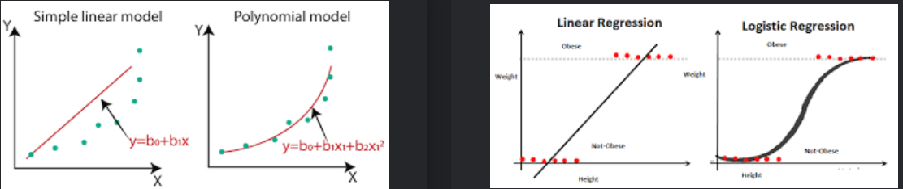
- Ridge Regression
    - Ridge regression is a model tuning method that is used to analyse any data that suffers from multicollinearity.
    - Ridge regression is a popular technique for reducing overfitting in linear regression models. Overfitting occurs when a model learns the training data too well and does not generalize well to new data. Ridge regression helps to prevent overfitting by shrinking the coefficients towards zero, which reduces the complexity of the model.
- Note:
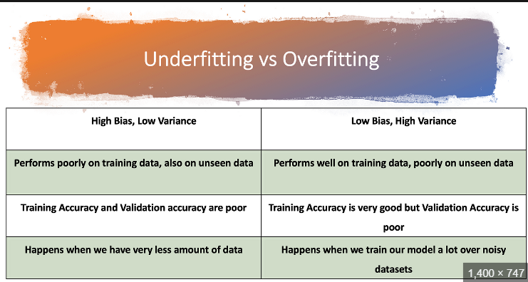
- Lasso regression:(shrinkage)
    - Lasso regression is a regularization technique. It is used over regression methods for a more accurate prediction. This model uses shrinkage. Shrinkage is where data values are shrunk towards a central point as the mean.
- KNN classification:
    - The k-nearest neighbors algorithm, also known as KNN or k-NN, is a non-parametric, supervised learning classifier, which uses proximity to make classifications or predictions about the grouping of an individual data point.
    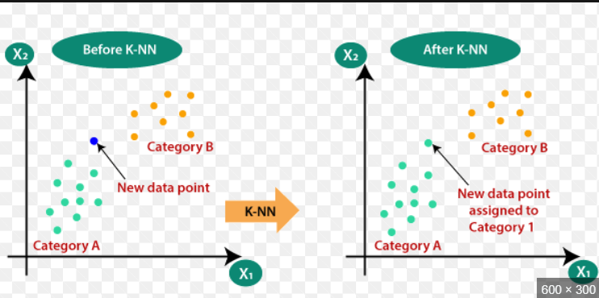
- Decision Trees:(both classification and regression)
    - A decision tree is one of the most powerful tools of supervised learning algorithms used for both classification and regression tasks.
    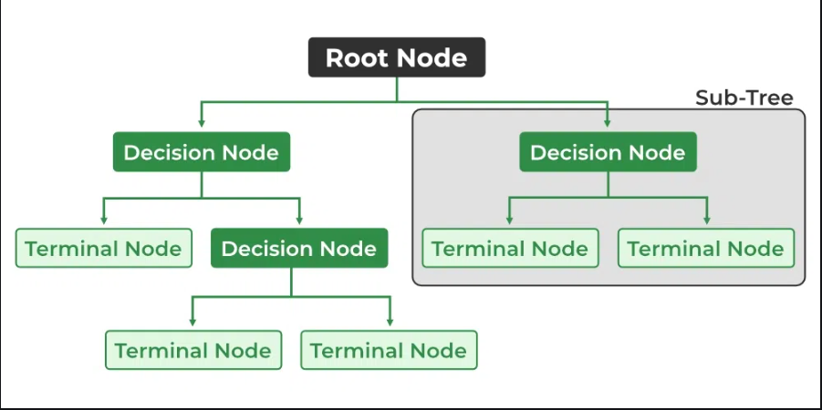
- Support vector machines:(cat and dog)
    - Support Vector Machine (SVM) is a powerful machine learning algorithm used for linear or nonlinear classification, regression, and even outlier detection tasks. SVMs can be used for a variety of tasks, such as text classification, image classification, spam detection, handwriting identification, gene expression analysis, face detection, and anomaly detection. 
    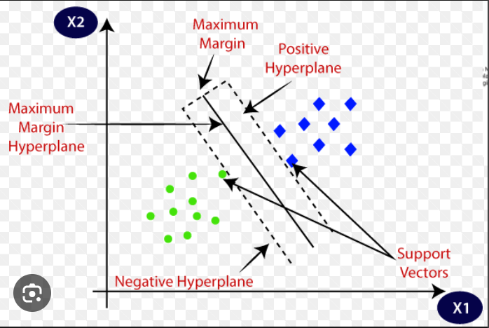
- Naive Bayes Classifier:
    - The Naïve Bayes classifier is a supervised machine learning algorithm, which is used for classification tasks, like text classification.
    - Naive Bayes classification is a simple and popular machine learning algorithm for classification tasks. It is based on the Bayes theorem, which is a formula for calculating the probability of an event given the probability of other events.
    - Naive Bayes classification assumes that the features of a data point are independent of each other. This means that the probability of a data point belonging to a particular class is the product of the probabilities of each of the features belonging to that class.
## ENSEMBLE TECHNIQUES
 Ensemble techniques in machine learning are methods that combine multiple models to create a more accurate or robust model. Ensemble techniques can be used for both classification and regression tasks.
- Random Forest:
    - Random forest is an ensemble machine learning algorithm that consists of many decision trees. It is a powerful tool for classification and regression tasks.
    - Random forest works by training many decision trees on different subsets of the training data. The predictions of the individual trees are then combined to create a final prediction.
    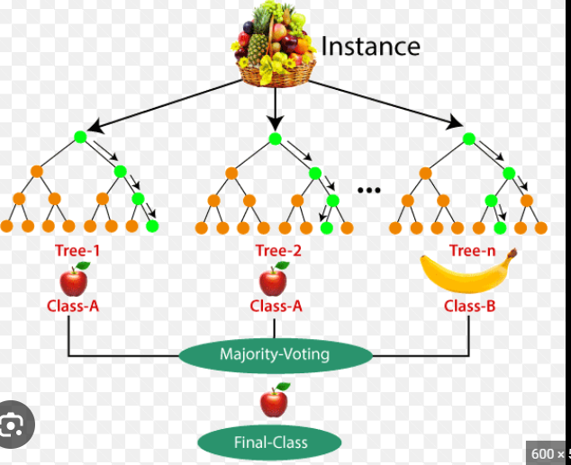
- Bagging:bootstrap aggregation
    - The random forest algorithm is a type of bagging ensemble. Bagging is a technique that creates multiple copies of a base model and trains each copy on a different bootstrap sample of the training data. The predictions of the base models are then combined to create a final prediction.
- Boosting:
    - Boosting is an ensemble modeling technique that attempts to build a strong classifier from the number of weak classifiers. It is done by building a model by using weak models in series. Firstly, a model is built from the training data. Then the second model is built which tries to correct the errors present in the first model. This procedure is continued and models are added until either the complete training data set is predicted correctly or the maximum number of models are added.
    
- Note:
    - Bootstrapping is a method of inferring results for a population from results found on a collection of smaller random samples of the population, using replacement during the sampling process.
- Adaboost:
    - AdaBoost, short for Adaptive Boosting, is an ensemble machine learning algorithm that combines multiple weak learners to create a strong learner. Weak learners are models that are only slightly better than random guessing.
    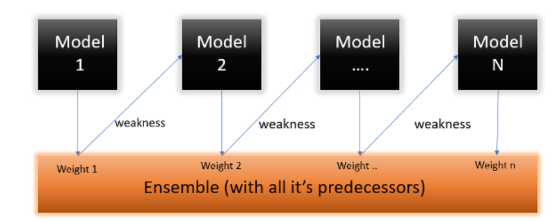
    - The weights of the weak learners are adjusted after each iteration, with the weights of the weak learners that make correct predictions being increased and the weights of the weak learners that make incorrect predictions being decreased. This means that the weak learners that are better at classifying the data are given more weight in the final prediction.
- GradientBoost:
    - Gradient boosting is also a sequential algorithm, but it trains the weak learners in a different way. Gradient boosting starts with a base model and then trains a sequence of weak learners to correct the errors of the previous model. The weights of the weak learners are adjusted so that they minimize the loss function of the model.
    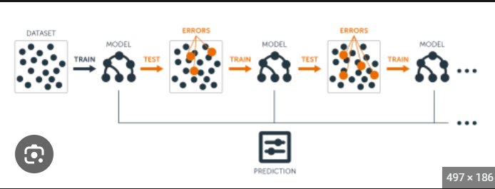
- XGBoost:
    - XGBoost is also a boosting machine learning algorithm, which is the next version on top of the gradient boosting algorithm. The full name of the XGBoost algorithm is the eXtreme Gradient Boosting algorithm, as the name suggests it is an extreme version of the previous gradient boosting algorithm.
    - The main difference between GradientBoosting is XGBoost is that XGbost uses a regularization technique in it. In simple words, it is a regularized form of the existing gradient-boosting algorithm.
- CatBoost:(categorical data)
    - In CatBoost the main difference that makes it different and better than others is the growing of decision trees in it. In CatBoost the decision trees which is grown are symmetric. One can easily install this library by using the below command:
    - CatBoost is a boosting algorithm that performs exceptionally very well on categorical datasets other than any algorithm in the field of machine learning as there is a special type of method for handling categorical datasets. In CatBoost, the categorical features are encoded on the basis of the output columns. So while training or encoding the categorical features, the weightage of the output column will also be considered which makes it higher accurate on categorical datasets.
- LightGBM:
    - LightGBM is also a boosting algorithm, which means Light Gradient Boosting Machine. It is used in the field of machine learning. In LightGBM decision trees are grown leaf wise meaning that at a single time only one leaf from the whole tree will be grown. One can install the required library by using the below command:
    - LightGBM also works well on categorical datasets and it also handles the categorical features using the binning or bucketing method. To work with categorical features in LightGBM we have converted all the categorical features in the category datatype. Once done, there will be no need to handle categorical data as it will handle it automatically.
    - In LightGBM, the sampling of the data while training the decision tree is done by the method known as GOSS. In this method, the variance of all the data samples is calculated and sorted in descending order. Data samples having low variance are already performing well, so there will be less weightage given to the samples having low variance while sampling the dataset.
## UNSUPERVISED LEARNING:
 Unsupervised learning, also known as unsupervised machine learning, uses machine learning algorithms to analyze and cluster unlabeled datasets. These algorithms discover hidden patterns or data groupings without the need for human intervention.
 - K means clustering:
    - K-means clustering is a type of unsupervised learning algorithm. Unsupervised learning algorithms are used to find patterns in data without any prior knowledge about the data.
    - K-means clustering works by dividing the data into k clusters. The number of clusters, k, is a hyperparameter that must be specified by the user. The algorithm works by iteratively assigning data points to clusters and then updating the cluster centroids.
    - The algorithm starts by randomly assigning the data points to clusters. The cluster- centroids are then calculated as the mean of the data points in each cluster. The data points are then reassigned to the cluster with the closest centroid. The cluster centroids are then updated again, and the process is repeated until the cluster assignments do not change.
    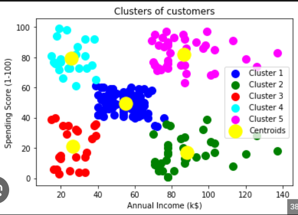
- DBSCAN:(density-based clustering algorithm)
    - DBSCAN is a clustering method that is used in machine learning to separate clusters of high density from clusters of low density.
    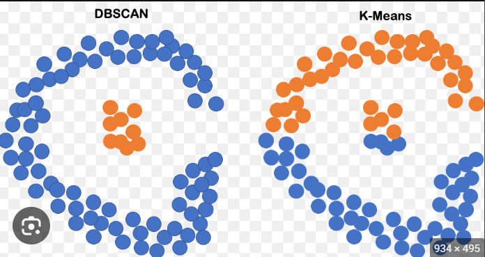
- Heirarchical Clustering:
    - Hierarchical clustering is a popular method for grouping objects. It creates groups so that objects within a group are similar to each other and different from objects in other groups.
- Dimensional Reduction:
    - Dimensionality reduction is the process of reducing the number of features (or dimensions) in a dataset while retaining as much information as possible. This can be done for a variety of reasons, such as to reduce the complexity of a model, to improve the performance of a learning algorithm, or to make it easier to visualize the data.
- PCA:(principal component analysis)
    - It works on the condition that while the data in a higher dimensional space is mapped to data in a lower dimension space, the variance of the data in the lower dimensional space should be maximum.
- Note- Variance: 
    - In machine learning variance is the amount by which the performance of a predictive model changes when it is trained on different subsets of the training data.
- Linear Discriminant Analysis(LDA):
    - Linear Discriminant Analysis (LDA) is a supervised learning algorithm used for classification tasks in machine learning. It is a technique used to find a linear combination of features that best separates the classes in a dataset.
    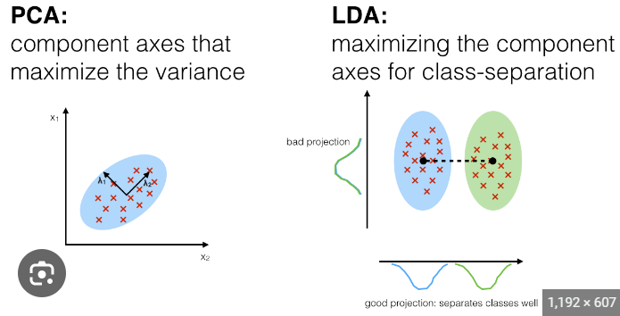
## FEATURIZATION(feature engineering or preprocessing),MODEL SELECTION,TUNING
- Featurization:
    - Featurization is a technique to improve your Machine Learning model. It allows to enrich your dataset with new data. Basically, Featurization is a synonym of Feature Engineering.
    - Feature engineering is the process of transforming raw data into features that are more informative and useful for machine learning algorithms. It is an important step in the machine learning process, as it can significantly improve the performance of the algorithms.
- Model Selection:
    - Model selection is the process of choosing the best machine learning model for a given task. It is an important step in the machine learning process, as it can significantly improve the performance of the models.
- Model Tuning:
    - Model tuning is also known as hyperparameter optimization. Hyperparameters are variables that control the training process. These are configuration variables that do not change during a Model training job. Model tuning provides optimized values for hyperparameters, which maximize your model's predictive accuracy.
- Model performance measures:
    - Model Performance Measures are the quantitative measures that provide an objective assessment of model performance, namely the standing of model output against prescribed criteria of accuracy, stability etc. depending on the model usage context.
- Regularization in linear model:
    - Regularization in Linear Regression. Regularization is a technique in machine learning that tries to achieve the generalization of the model. It means that our model works well not only with training or test data, but also with the data it'll receive in the future.
    - In machine learning, we often face the problem when our model behaves well on training data but behaves very poorly on test data. This happens when the model closely follows the training data i.e overfits the data. Regularization is a technique to reduce overfitting.
- ML Pipeline:
    - A machine learning pipeline is the end-to-end construct that orchestrates the flow of data into, and output from, a machine learning model (or set of multiple models). It includes raw data input, features, outputs, the machine learning model and model parameters, and prediction outputs.
    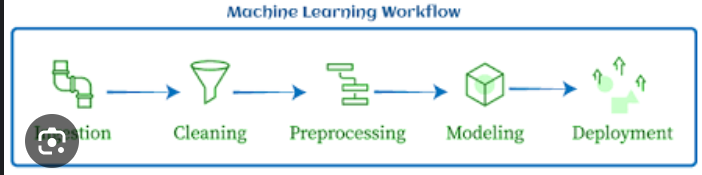
- Bootstrap sampling:
    - Bootstrap sampling is used in a machine learning ensemble algorithm called bootstrap aggregating (also called bagging). It helps in avoiding overfitting and improves the stability of machine learning algorithms.
    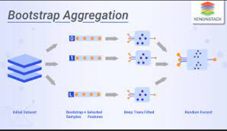
- Grid search cv:(cross validation)
    - Grid search is a technique for tuning machine learning models by systematically searching a grid of hyperparameter values. This is a more efficient way to tune models than manual tuning, but it can be computationally expensive if the grid is large.
- Randomised search cv:
    - Randomized cross-validation (also known as random search or random grid search) is a technique for tuning machine learning models that is similar to grid search. However, instead of searching over a grid of hyperparameter values, randomized cross-validation randomly samples hyperparameter values from a distribution. This can be more efficient than grid search if the search space is large, but it can be less effective if the distribution is not well-chosen.  
- K fold cv: 
    - K-fold cross-validation is a technique for evaluating the performance of a machine learning model by partitioning the data into k folds. The model is then trained on k-1 folds and evaluated on the remaining fold. This process is repeated k times, and the results are averaged to get an estimate of the model's performance.
- Libraries used:
    - numpy
    - pandas
    - scikit-learn
    - xgboost
    - pycaret:
        - PyCaret is an open-source, low-code machine learning library in Python that automates machine learning workflows. It is an end-to-end machine learning and model management tool that speeds up the experiment cycle exponentially and makes you more productive.