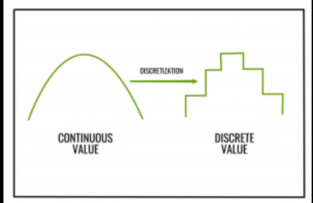
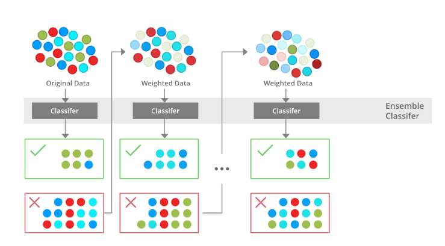

# MACHINE LEARNING

## FEATURE ENGINEERING AND DATA PREPROCESSING
- Every ML algorithm requires data to be in a specific format.
- Every model requires the data in the form of numbers.
- Imputations:Imputation is a technique in machine learning that is used to replace missing values in a dataset.
- Handling outliers
- Handling class imbalance 
- Normalisation:
    - Normalization and standardization are two data preprocessing techniques that are used to improve the performance of machine learning models.
    - Normalization is a technique that is used to scale the values of features in a dataset so that they have a mean of 0 and a standard deviation of 1. This helps to ensure that all of the features are on the same scale and that they have a similar range of values.
- Standardisation:
    - Standardization is a technique that is similar to normalization, but it scales the values of features so that they have a mean of 0 and a standard deviation of 1. However, standardization also takes into account the variance of the features. This means that features with a high variance will be scaled more than features with a low variance.
    - The choice of whether to use normalization or standardization depends on the specific machine learning model that is being used. Some models, such as linear regression, are not sensitive to the scale of the features and can be used with either normalization or standardization. Other models, such as support vector machines, are more sensitive to the scale of the features and should be used with standardization.
- Polynomial feature transformation:
    - In machine learning, polynomial feature transformation is a technique that is used to create new features from existing features by raising them to a polynomial power. This can be done to improve the accuracy of machine learning models, especially for models that are sensitive to the non-linear relationships between features.
- One hot encoding:
    - One-hot encoding is a technique used to convert categorical data into a form that can be understood by machine learning algorithms.
    - One-hot encoding is a powerful technique that can be used to improve the accuracy of machine learning algorithms. However, it is important to note that one-hot encoding can also increase the size of the dataset, which can make training the model more computationally expensive.
- Binning: 
    - Binning is a technique used in machine learning to divide continuous data into discrete bins. This can be done to improve the accuracy of machine learning algorithms, especially for algorithms that are sensitive to the distribution of the data.
    
- Feature selection:
    - Feature selection is a process of selecting the most relevant features from a dataset for a machine learning model. This can be done to improve the accuracy of the model, reduce its complexity, and make it more interpretable.
- Feature split:
    - Feature split is the process of dividing a feature into two or more parts. This can be done to improve the accuracy of machine learning models, especially for models that are sensitive to the distribution of the data.
- Extracting dates:
    - Extracting dates in ML is a process of identifying and extracting dates from text data.
## SUPERVISED LEARNING
- Linear regression
    - Linear regression is a type of supervised machine learning algorithm that computes the linear relationship between a dependent variable and one or more independent features.
- Logistic regression:(sigmoid)
    - Logistic regression is a supervised machine learning algorithm mainly used for classification tasks where the goal is to predict the probability that an instance of belonging to a given class. It is used for classification algorithms its name is logistic regression. it’s referred to as regression because it takes the output of the linear regression function as input and uses a sigmoid function to estimate the probability for the given class.Logistic regression is used for solving the classification problems.
- Polynomial Regression
    - Polynomial regression is a type of regression analysis that models the relationship between a dependent variable and one or more independent variables by fitting a polynomial function to the data. The polynomial function can be of any degree, but it is typically a second-degree or third-degree polynomial.
    - Polynomial regression is a powerful tool for modeling non-linear relationships between variables. For example, if we want to model the relationship between the height of a person and their weight, we could use a polynomial regression model. The model would fit a polynomial function to the data, and we could use the function to predict the weight of a person given their height.
    
- Ridge Regression
    - Ridge regression is a model tuning method that is used to analyse any data that suffers from multicollinearity.
    - Ridge regression is a popular technique for reducing overfitting in linear regression models. Overfitting occurs when a model learns the training data too well and does not generalize well to new data. Ridge regression helps to prevent overfitting by shrinking the coefficients towards zero, which reduces the complexity of the model.
- Note:

- Lasso regression:(shrinkage)
    - Lasso regression is a regularization technique. It is used over regression methods for a more accurate prediction. This model uses shrinkage. Shrinkage is where data values are shrunk towards a central point as the mean.
- KNN classification:
    - The k-nearest neighbors algorithm, also known as KNN or k-NN, is a non-parametric, supervised learning classifier, which uses proximity to make classifications or predictions about the grouping of an individual data point.
    
- Decision Trees:(both classification and regression)
    - A decision tree is one of the most powerful tools of supervised learning algorithms used for both classification and regression tasks.
    
- Support vector machines:(cat and dog)
    - Support Vector Machine (SVM) is a powerful machine learning algorithm used for linear or nonlinear classification, regression, and even outlier detection tasks. SVMs can be used for a variety of tasks, such as text classification, image classification, spam detection, handwriting identification, gene expression analysis, face detection, and anomaly detection. 
    
- Naive Bayes Classifier:
    - The Naïve Bayes classifier is a supervised machine learning algorithm, which is used for classification tasks, like text classification.
    - Naive Bayes classification is a simple and popular machine learning algorithm for classification tasks. It is based on the Bayes theorem, which is a formula for calculating the probability of an event given the probability of other events.
    - Naive Bayes classification assumes that the features of a data point are independent of each other. This means that the probability of a data point belonging to a particular class is the product of the probabilities of each of the features belonging to that class.
## ENSEMBLE TECHNIQUES
 Ensemble techniques in machine learning are methods that combine multiple models to create a more accurate or robust model. Ensemble techniques can be used for both classification and regression tasks.
- Random Forest:
    - Random forest is an ensemble machine learning algorithm that consists of many decision trees. It is a powerful tool for classification and regression tasks.
    - Random forest works by training many decision trees on different subsets of the training data. The predictions of the individual trees are then combined to create a final prediction.
    
- Bagging:
    - The random forest algorithm is a type of bagging ensemble. Bagging is a technique that creates multiple copies of a base model and trains each copy on a different bootstrap sample of the training data. The predictions of the base models are then combined to create a final prediction.
- Boosting:
    - Boosting is an ensemble modeling technique that attempts to build a strong classifier from the number of weak classifiers. It is done by building a model by using weak models in series. Firstly, a model is built from the training data. Then the second model is built which tries to correct the errors present in the first model. This procedure is continued and models are added until either the complete training data set is predicted correctly or the maximum number of models are added.
    
- Note:
    - Bootstrapping is a method of inferring results for a population from results found on a collection of smaller random samples of the population, using replacement during the sampling process.