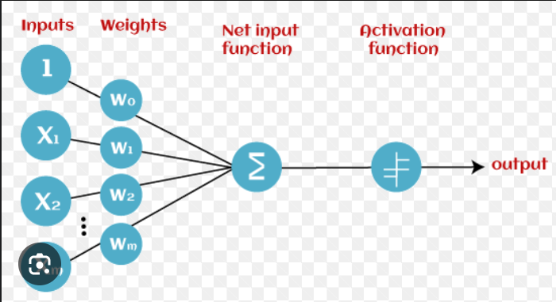
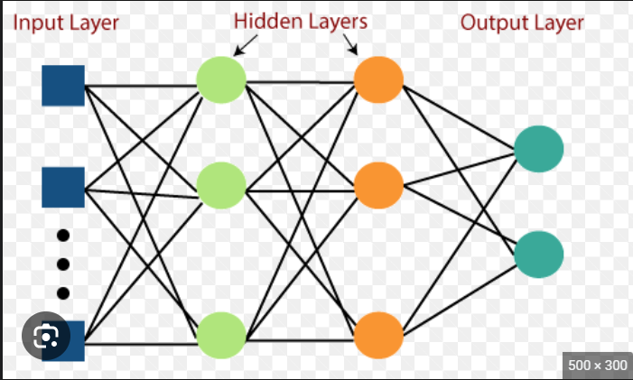
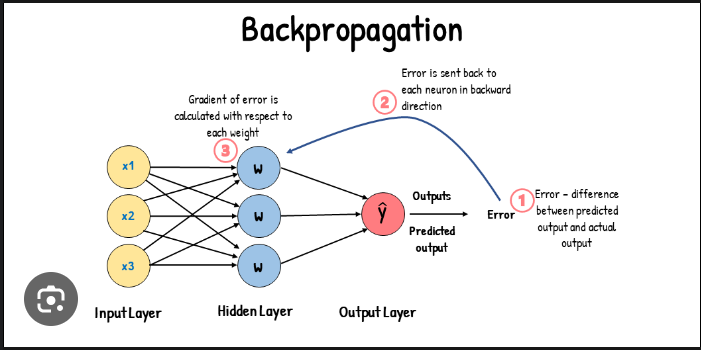
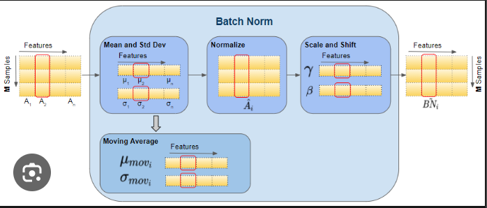
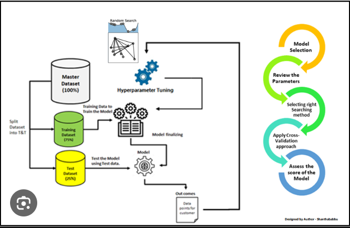

## ARTIFICIAL INTELLIGENCE - INTRODUCTION TO NEURAL NETWORKS(non linear data,images) AND DEEP LEARNING
- A neural network is a method in artificial intelligence that teaches computers to process data in a way that is inspired by the human brain. It is a type of machine learning process, called deep learning, that uses interconnected nodes or neurons in a layered structure that resembles the human brain.
- Deep learning is a machine learning technique that teaches computers to do what comes naturally to humans: learn by example. Deep learning is a key technology behind driverless cars, enabling them to recognize a stop sign, or to distinguish a pedestrian from a lamppost.
- Biological neurons:
    - Neurons are the structural and functional unit of the nervous system. All neurons have three different parts – dendrites, cell body and axon. The neuron structure is specially adapted to carry messages over large distances in the body quickly in the form of electrical signals.
- Perceptron:
    - The perceptron is a simple artificial neuron that is the basic building block of neural networks. It is a single-layer neural network that takes a set of input signals and outputs a single output signal. The output signal is determined by a weighted sum of the input signals and a threshold function.  
    
- Multi layered perceptron:
    - A multilayer perceptron (MLP) is a type of artificial neural network that is composed of multiple layers of perceptrons. Each layer of perceptrons is connected to the next layer, and the output of each perceptron in one layer is used as the input to the perceptrons in the next layer.
    - MLPs are used for supervised learning, which means that they are trained on a dataset of labeled data. The labeled data consists of input vectors and their corresponding desired outputs. The MLP learns to map the input vectors to the desired outputs by adjusting the weights of the connections between the perceptrons.
    
    - Multi-layer perceptions are a network of neurons that can be used in binary/multiple class classification as well as regression problems.
- Regression Multi layered perceptron:
    - Regression is a supervised learning task that involves predicting a continuous value, such as the price of a house or the number of sales in a given month. Multilayer perceptrons (MLPs) are a type of neural network that can be used for regression.
    - MLPs for regression typically have one input layer, one or more hidden layers, and one output layer. The input layer takes the features of the data as input, and the output layer outputs the predicted value. The hidden layers learn to extract features from the data that are relevant to the prediction task.
    - MLPs for regression can be trained using a variety of methods, such as backpropagation. Backpropagation is an algorithm that adjusts the weights of the MLP so that the network learns to minimize the error between the predicted values and the actual values.
    - MLPs have been shown to be effective for a variety of regression tasks. For example, they have been used to predict the price of houses, the number of sales in a given month, and the risk of heart disease.
- Classification multi layered perceptron:
    - MLPClassifier stands for Multi-layer Perceptron classifier which in the name itself connects to a Neural Network. Unlike other classification algorithms such as Support Vectors or Naive Bayes Classifier, MLPClassifier relies on an underlying Neural Network to perform the task of classification.
    - Multilayer perceptrons (MLPs) are a type of artificial neural network that can be used for classification. Classification is a supervised learning task that involves predicting a categorical value, such as the species of a flower or the sentiment of a piece of text.
    - MLPs for classification typically have one input layer, one or more hidden layers, and one output layer. The input layer takes the features of the data as input, and the output layer outputs the predicted class. The hidden layers learn to extract features from the data that are relevant to the classification task.
    - MLPs for classification can be trained using a variety of methods, such as backpropagation. Backpropagation is an algorithm that adjusts the weights of the MLP so that the network learns to minimize the error between the predicted classes and the actual classes.
- Activation function:
    - Activation functions are used to introduce non-linearity into the output of a neuron. This is important because it allows neural networks to learn more complex relationships between the input and output data. Some common activation functions include the sigmoid function, the tanh function, and the ReLU function.
    - The activation function of a neuron defines it’s output given its inputs.
    - An Activation Function decides whether a neuron should be activated or not. This means that it will decide whether the neuron's input to the network is important or not in the process of prediction using simpler mathematical operations.
- Loss function:
    - Loss functions are used to measure the error between the predicted output of a neural network and the actual output. This error is then used to update the weights of the neural network so that it can learn to make better predictions. Some common loss functions include the mean squared error (MSE) function, the cross-entropy loss function, and the hinge loss function.
    - The other key aspect in setting up the neural network infrastructure is selecting the right loss functions. With neural networks, we seek to minimize the error (difference between actual and predicted value) which is calculated by the loss function.
- Gradient descent:
    - Gradient descent is an iterative optimization algorithm for finding the minimum of a function. The idea is to start at a random point and then repeatedly move in the direction of the steepest descent until the minimum is reached.
    - In machine learning, gradient descent is used to train neural networks. The weights of the neural network are adjusted iteratively so that the network learns to minimize the loss function.

    - The gradient descent algorithm is as follows:

        - Start with a random set of weights.
        - Calculate the gradient of the loss function with respect to the weights.
        - Move in the direction of the negative gradient.
        - Repeat steps 2 and 3 until the loss function converges.
    - The gradient of the loss function is a vector that points in the direction of the steepest descent. The negative gradient points in the opposite direction, which is the direction of the steepest ascent.
    - The step size is the amount that the weights are moved in each iteration. The step size should be small enough so that the algorithm does not overshoot the minimum.
- Back propagation:
    - Backpropagation, or backward propagation of errors, is an algorithm that is designed to test for errors working back from output nodes to input nodes. It is an important mathematical tool for improving the accuracy of predictions in data mining and machine learning.
    - Backpropagation is an algorithm used to train artificial neural networks. It is a type of gradient descent algorithm that is used to update the weights of a neural network so that the network learns to minimize the loss function.
    - The backpropagation algorithm works by propagating the error from the output layer of the neural network back to the input layer. The error is then used to update the weights of the neural network so that the network learns to make better predictions.

    - The backpropagation algorithm is as follows:

        - Start with a random set of weights.
        - Calculate the error at the output layer.
        - Backpropagate the error through the neural network.
        - Update the weights of the neural network.
        - Repeat steps 2-4 until the loss function converges.
    
- Batch normalization:
    - Batch normalization (BN) is a technique used to improve the training of deep neural networks. It is a regularization technique that helps to stabilize the learning process and prevent the network from overfitting.
    - BN works by normalizing the activations of each layer in the network. This means that the activations are scaled and shifted so that they have a mean of 0 and a standard deviation of 1. This helps to ensure that the network is learning meaningful features and not just noise.
    
- Hyperparameter tuning:
    - In machine learning, hyperparameter tuning is the process of finding the optimal values for the hyperparameters of a machine learning model. Hyperparameters are the parameters that control the learning process of the model, such as the learning rate, the number of layers, and the number of neurons in each layer.
    - The optimal values for the hyperparameters of a machine learning model depend on the specific dataset and the problem that the model is trying to solve. There is no single set of hyperparameters that will work best for all models and datasets.
    - Hyperparameter tuning can be a time-consuming and computationally expensive process. However, it can be worth the effort, as it can lead to significant improvements in the performance of the model.
    