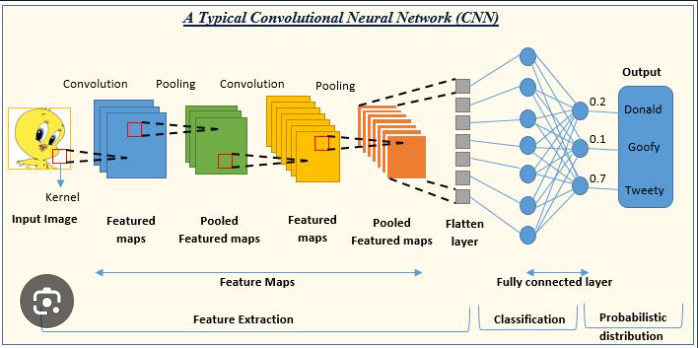
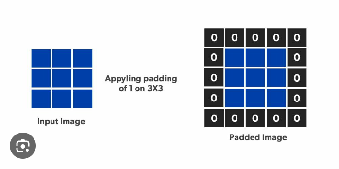
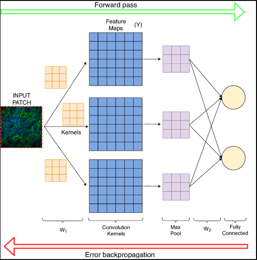

# CONVOLUTIONAL NEURAL NETWORKS(CNN)

- Introduction to convolutional neural networks:
    - A convolutional neural network (CNN) is a type of artificial neural network used primarily for image recognition and processing, due to its ability to recognize patterns in images. A CNN is a powerful tool but requires millions of labelled data points for training.
    - A convolutional neural network (CNN) is a type of artificial neural network that is specifically designed for processing data that has a grid-like structure, such as images. CNNs are able to learn spatial relationships in data, which makes them well-suited for tasks such as image classification, object detection, and natural language processing.
    
- Convolution:
    - A convolution converts all the pixels in its receptive field into a single value. For example, if you would apply a convolution to an image, you will be decreasing the image size as well as bringing all the information in the field together into a single pixel. The final output of the convolutional layer is a vector.
    - The term convolution refers to the mathematical combination of two functions to produce a third function. It merges two sets of information. In the case of a CNN, the convolution is performed on the input data with the use of a filter or kernel (these terms are used interchangeably) to then produce a feature map.
    - The convolution operation takes two inputs: a kernel and an input image. The kernel is a small matrix of weights that is used to scan the input image. The convolution operation slides the kernel across the input image and calculates the dot product of the kernel and the input image at each position. The output of the convolution operation is a feature map, which is a representation of the input image that highlights the features that are detected by the kernel.
- Pooling:
    - Pooling layers are used to reduce the dimensions of the feature maps. Thus, it reduces the number of parameters to learn and the amount of computation performed in the network. The pooling layer summarises the features present in a region of the feature map generated by a convolution layer.
    - Pooling is a technique used in convolutional neural networks (CNNs) to reduce the size of the feature maps while preserving the most important features. Pooling is typically performed after the convolution operation, and it helps to reduce the computational complexity of the CNN.
    
- Padding:
    - Padding is a term relevant to convolutional neural networks as it refers to the amount of pixels added to an image when it is being processed by the kernel of a CNN. For example, if the padding in a CNN is set to zero, then every pixel value that is added will be of value zero.
    - Padding in machine learning is a technique used to add zeros around the edges of an input image or signal before it is processed by a convolutional neural network (CNN). Padding helps to preserve the spatial information in the input data, which can improve the performance of the CNN.
    
- Forward propagation for CNN:
    - During forward propagation at each node of hidden and output layer preactivation and activation takes place. For example at the first node of the hidden layer, a1(preactivation) is calculated first and then h1(activation) is calculated.
    - Forward propagation in a convolutional neural network (CNN) is the process of passing an input image through the network to produce an output prediction. The forward propagation process can be broken down into the following steps:

        - Image preprocessing: The input image is preprocessed to normalize the pixel values and to convert the image to a format that the CNN can understand.
        - Convolution: The preprocessed image is passed through a series of convolutional layers. Each convolutional layer applies a convolution operation to the input image, which extracts features from the image.
        - Pooling: The output of the convolutional layers is passed through a series of pooling layers. Each pooling layer reduces the size of the feature maps while preserving the most important features.
        - Fully connected layers: The output of the pooling layers is passed through a series of fully connected layers. Fully connected layers are traditional neural networks that perform a linear transformation on the input data.
        - Output layer: The output of the fully connected layers is passed to the output layer. The output layer produces a prediction for the input image.
    - The forward propagation process is repeated for each input image. The output predictions are then used to train the CNN.
    
- Back propagation for CNN:
    - Backpropagation is an algorithm used to train artificial neural networks. It works by propagating the error from the output layer of the network back to the input layer. The error is then used to update the weights of the network so that the network learns to make better predictions.
    - In a CNN, backpropagation works by propagating the error from the output layer of the network through the convolutional layers, the pooling layers, and the fully connected layers. The error is then used to update the weights of the network so that the network learns to extract features that are more relevant to the output prediction.

    - The backpropagation algorithm is as follows:

        - Calculate the error at the output layer.
        - Backpropagate the error through the fully connected layers.
        - Backpropagate the error through the pooling layers.
        - Backpropagate the error through the convolutional layers.
        - Update the weights of the network.
    - The backpropagation algorithm is repeated for each input image. The weights of the network are updated until the network converges, which means that the network is making accurate predictions.