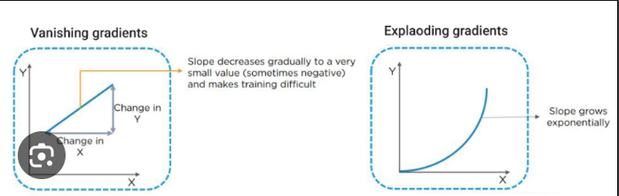

# RECURRENT NEURAL NETWORKS
Recurrent neural networks (RNNs) are the state of the art algorithm for sequential data and are used by Apple's Siri and Google's voice search. It is the first algorithm that remembers its input, due to an internal memory, which makes it perfectly suited for machine learning problems that involve sequential data.

Recurrent neural networks (RNNs) are a type of neural network that is specifically designed for processing data that has a temporal order, such as text, speech, and music. RNNs are able to learn long-range dependencies in the data, which makes them well-suited for tasks such as machine translation, speech recognition, and natural language processing.

RNNs work by maintaining a state that is updated over time. This state is used to store information about the past inputs, which can then be used to predict the next output. RNNs can be used to model a variety of temporal patterns, including sequences of words, sequences of sounds, and sequences of events.

- Introduction to sequential data:
    - Whenever the points in the dataset are dependent on the other points in the dataset the data is said to be Sequential data. A common example of this is a Timeseries such as a stock price or a sensor data where each point represents an observation at a certain point in time.
    - Sequential data is a type of data that has a temporal order. This means that the data points in the sequence are not independent of each other, but are instead related to each other in time. Sequential data can be found in a variety of domains, including natural language processing, speech recognition, and financial trading.
    - Machine learning algorithms that are designed to work with sequential data are called sequence models. Sequence models are able to learn the temporal relationships between the data points in the sequence, which allows them to make predictions about future data points.
- Mechanism of RNN:
    - The mechanism of RNN can be broken down into the following steps:

        - The RNN is given an input sequence.
        - The RNN updates its state based on the input sequence.
        - The RNN predicts the next output.
        - The RNN repeats steps 2-3 until the end of the input sequence.
    - The state of the RNN is a vector that stores information about the past inputs. This information can be used to predict the next output. The state of the RNN is updated using a function called the "recurrent unit". The recurrent unit takes the current input and the previous state as input, and it outputs a new state.
    - The recurrent unit is typically a neural network. This means that the recurrent unit has weights that are learned during the training process. The weights of the recurrent unit are updated so that the RNN can learn to predict the next output as accurately as possible.
- Vanishing gradient:
    - The vanishing gradient problem is a problem that occurs in recurrent neural networks (RNNs) when the gradients of the loss function with respect to the weights of the RNN become very small as the sequence length increases. This can make it difficult for the RNN to learn long-range dependencies in the data.
    - The vanishing gradient problem is caused by the way that RNNs are trained. RNNs are typically trained using backpropagation, which means that the gradients of the loss function are propagated back through the network to update the weights. However, as the sequence length increases, the gradients can become very small, which makes it difficult for the weights to be updated.
- Exploding gradient:
    - In RNNs, during the backpropagation process, gradients are computed and used to update the network's weights in order to minimize the training loss. However, in some cases, the gradients can become extremely large during backpropagation, causing the network's weights to be updated by large amounts. This can lead to a situation where the weights grow exponentially, resulting in unstable and ineffective training. This phenomenon is known as the "exploding gradient" problem.
    - When gradients explode, the weight updates can be so large that the model's parameters move too far in the wrong direction, preventing the model from converging to a good solution. As a result, the training process becomes unstable, and the model's performance may not improve or even deteriorate.
    
- LSTMs(Long Term Short Memory):
    - Long short-term memory (LSTM) network is a recurrent neural network (RNN), aimed to deal with the vanishing gradient problem present in traditional RNNs. Its relative insensitivity to gap length is its advantage over other RNNs, hidden Markov models and other sequence learning methods.
    - Long short-term memory (LSTM) is a type of recurrent neural network (RNN) that is specifically designed to learn long-range dependencies in data. LSTMs are able to do this by using a special type of unit called a "memory cell" to store information about the past inputs. This allows LSTMs to learn long-range dependencies in the data even when the sequence length is long.
- Gated recurrent unit:(GRUs)
    - The Gated Recurrent Unit (GRU) is a type of Recurrent Neural Network (RNN) that, in certain cases, has advantages over long short term memory (LSTM). GRU uses less memory and is faster than LSTM, however, LSTM is more accurate when using datasets with longer sequences.