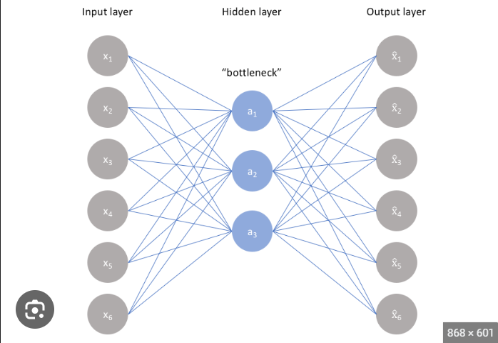
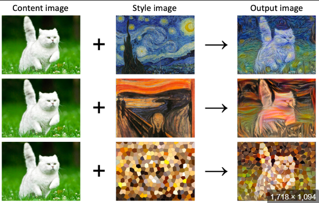

# ADVANCEMENTS IN DEEP LEARNING

Deep learning is a subfield of machine learning that focuses on using artificial neural networks to model and solve complex problems. It is called "deep" because it involves training models with multiple layers, allowing them to learn hierarchical representations of data. Deep learning has achieved significant breakthroughs in various domains, including computer vision, natural language processing, speech recognition, and reinforcement learning.

Deep learning is a machine learning technique that teaches computers to do what comes naturally to humans: learn by example. Deep learning is a key technology behind driverless cars, enabling them to recognize a stop sign, or to distinguish a pedestrian from a lamppost.

- Auto Encoders:
    - Autoencoders are used to help reduce the noise in data. Through the process of compressing input data, encoding it, and then reconstructing it as an output, autoencoders allow you to reduce dimensionality and focus only on areas of real value.
    - The primary goal of an autoencoder is to reconstruct its input data as accurately as possible at the output layer, effectively learning an identity function. However, the architecture of an autoencoder forces it to go through a bottleneck layer, which has a lower dimensionality than the input. This bottleneck layer is where the data is compressed and where the most informative features are learned.
    - An autoencoder is a type of artificial neural network that is trained to reconstruct its input. The autoencoder is composed of two parts: an encoder and a decoder. The encoder takes the input data and compresses it into a latent representation. The decoder then takes the latent representation and reconstructs the original input data.
    - 
- Style Transfer:
    - Style transfer is a popular technique in the field of computer vision and deep learning that allows for the artistic transformation of images. It involves combining the content of one image with the style of another image to create a new image that merges both the content and style.
    - Style transfer is a technique that allows you to apply the style of one image to another image. This can be done using a technique called neural style transfer, which uses a neural network to learn the style of an image and then apply that style to another image.
    - 
- Generative Adversarial Network:(GANs)
    - GANs perform unsupervised learning tasks in machine learning. It consists of 2 models that automatically discover and learn the patterns in input data.
    - GANs are a type of generative model that learn to generate new data samples that resemble a given training dataset. The key idea behind GANs is to train two neural networks, a generator and a discriminator, in a two-player minimax game framework.
    - Generator: The generator is a neural network that takes random noise as input and generates synthetic data samples. During training, the generator aims to produce data that is indistinguishable from the real data in the training set.

    - Discriminator: The discriminator is another neural network that acts as a binary classifier. It takes as input both real data samples from the training set and synthetic data samples from the generator. The discriminator's objective is to correctly classify whether the input data is real (from the training set) or fake (generated by the generator).

    - The training process of GANs can be summarized as follows:

        - The generator creates synthetic data samples by taking random noise as input and generating data.
        - The discriminator is trained to distinguish between real data and synthetic data. It aims to maximize the probability of correctly classifying real and fake samples.
        - The generator is trained to fool the discriminator. It aims to minimize the probability of the discriminator correctly classifying its generated samples as fake.
        - The generator and discriminator play this two-player minimax game, where the generator tries to improve its ability to generate realistic data, while the discriminator tries to improve its ability to distinguish real from fake data.

    - Over time, through this adversarial training process, the generator becomes increasingly skilled at producing realistic data, while the discriminator becomes better at distinguishing real and fake data. Ideally, when the GAN converges, the generator produces high-quality data that is almost indistinguishable from the real data in the training set.
- Transformers:
    - Transformers are a type of neural network architecture that is specifically designed for sequence-to-sequence tasks. Sequence-to-sequence tasks are tasks where the input is a sequence of data and the output is also a sequence of data. For example, machine translation is a sequence-to-sequence task where the input is a sequence of words in one language and the output is a sequence of words in another language.
    - The key innovation of transformers is the self-attention mechanism, which allows the model to focus on different parts of the input sequence while processing it. Unlike traditional recurrent neural networks (RNNs) or convolutional neural networks (CNNs), transformers do not rely on sequential processing, making them highly parallelizable and more efficient for long-range dependencies in sequential data.
    - Transformers can be used to create general models that can be fine-tuned for specific tasks. This enables the use of transfer learning, where the pre-trained models can be used for various tasks, reducing the need for large amounts of data and training time.
- Libraries Used:
    - TensorFlow:
        - TensorFlow is an open-source software library for numerical computation using data flow graphs. It is used for machine learning, data science, and artificial intelligence.
    - Pytorch Library:
        - PyTorch is a powerful tool for machine learning. It is similar to TensorFlow, but it is more flexible and easier to learn. PyTorch is also better suited for deep learning tasks.
        - Like TensorFlow, PyTorch is widely used for building and training machine learning models, particularly deep learning models
    - Keras