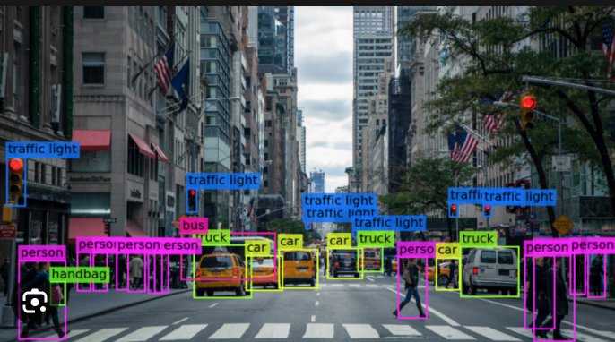
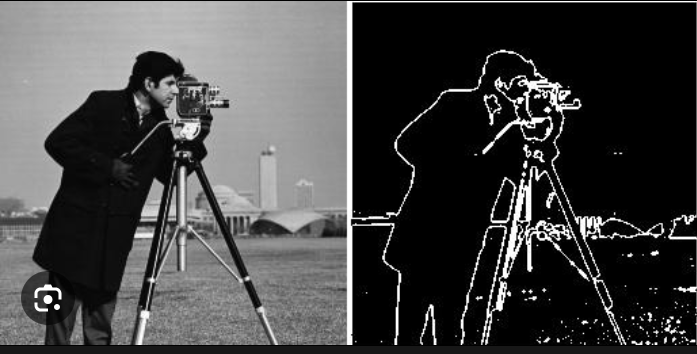
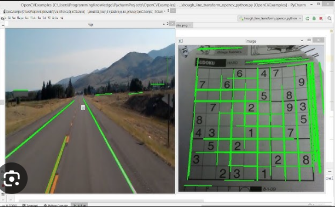
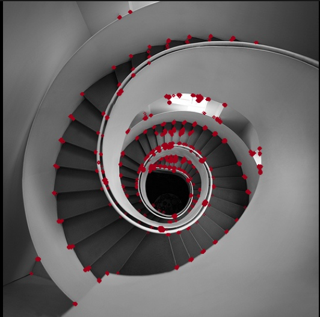
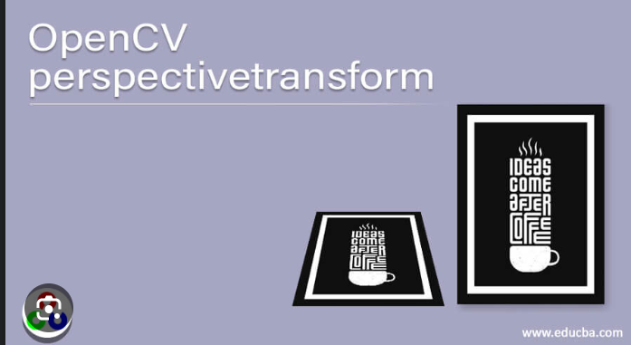
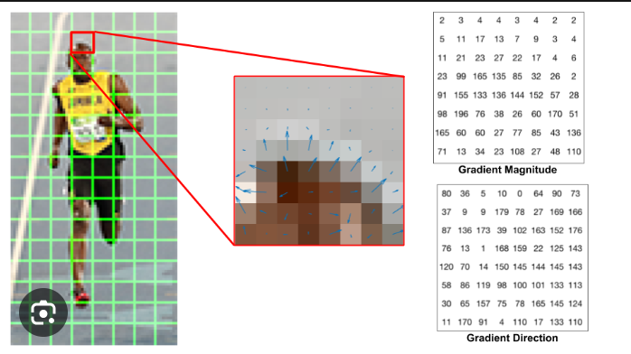

Computer vision is a field of artificial intelligence (AI) that enables computers and systems to derive meaningful information from digital images, videos and other visual inputs — and take actions or make recommendations based on that information.

# Introduction to OpenCV

OpenCV is a great tool for image processing and performing computer vision tasks. It is an open-source library that can be used to perform tasks like face detection, objection tracking, landmark detection, and much more.

- Basic image read/write operations
    - Image processing is a key component of computer vision, involving basic operations such as color, brightness, contrast, and sharpness adjustments. Image segmentation divides images into smaller regions or objects using techniques like thresholding and edge detection.
- Image filters:
    - Image filters are widely used in computer vision to process images by modifying their pixel values or characteristics. Filters are applied to images to enhance specific features, remove noise, detect edges, or perform other transformations to extract relevant information from the visual data. 
    - Image filtering changes the range (i.e. the pixel values) of an image, so the colors of the image are altered without changing the pixel positions, while image warping changes the domain (i.e. the pixel positions) of an image, where points are mapped to other points without changing the colors.
- Edge detection:
    - Edge detection is a fundamental technique in computer vision used to identify and highlight boundaries or edges between different objects and regions in an image. Edges correspond to areas of rapid intensity changes, such as the boundaries between objects with different colors, textures, or intensities. Detecting edges is a crucial preprocessing step for various computer vision tasks, including object detection, image segmentation, and feature extraction.
    - Edge detection is a technique used to find the edges in an image. Edges are the boundaries between different regions in an image. They can be used to identify objects in an image or to segment an image into different regions.
    - Edge detection works by detecting discontinuities in brightness.

    - 
- Hough transform:
    - The Hough Transform is a widely used technique in computer vision for detecting lines and other shapes, such as circles or ellipses, in an image. It is particularly useful for applications like image analysis, object recognition, and image-based measurements.
    - The Hough transform is a technique used to detect lines in images. It is a two-step process:
        - The first step is to transform the image into a Hough space. This is a parameterized space where each point in the image corresponds to a line in Hough space.
        - The second step is to search for lines in Hough space that have a high score. The score of a line is determined by how many points in the image lie on the line.
    - The Hough transform is a powerful tool for line detection. It can be used to detect lines in images that are noisy or have low contrast.
    - 
- Corner detection:
    - Corner detection is a fundamental technique in computer vision used to identify and locate key points or corners in an image. Corners are points where the intensity or color of an image significantly changes in multiple directions. These points are essential for various computer vision applications, such as feature matching, image alignment, object recognition, and camera calibration.
    - Corner detection is a technique used to find corners in images. Corners are points in an image where the image gradient changes significantly in two or more directions. They can be used to identify objects in an image or to segment an image into different regions.
    - The purpose of detecting corners is to track things like motion, do 3D modeling, and recognize objects, shapes, and characters.
    - 
- Perspective transformation:
    - Perspective transformation is a common technique in computer vision used to change the perspective of an image by transforming it into a new view, as if it were taken from a different viewpoint. This transformation is especially useful for tasks like image rectification, image stitching, and 3D scene reconstruction.
    - A perspective transformation is a type of geometric transformation that changes the perspective of an image. It is often used to straighten images that have been taken at an angle, or to warp images to fit a specific desired shape.
    - 
- HOG filters:
    - HOG (Histogram of Oriented Gradients) is a feature descriptor used in computer vision and image processing for object detection and recognition tasks.
    - The HOG feature descriptor is designed to capture local gradient information from an image, which is useful for detecting object edges and boundaries. It works by dividing the image into small cells, calculating the gradient orientations and magnitudes within each cell, and then grouping these gradient values into histogram bins based on their orientations. The resulting histogram of gradients provides a compact representation of the local edge patterns in the image.
    - 