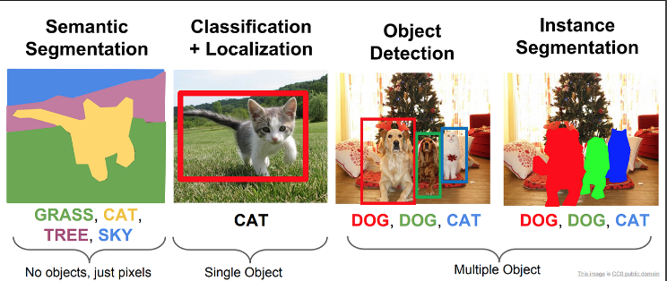
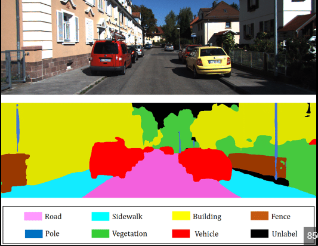
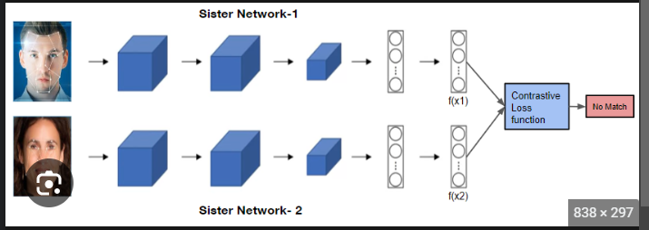
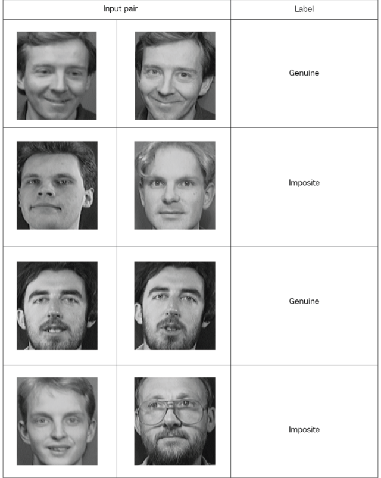

# ADVANCED COMPUTER VISION

- TensorFlow:
    - TensorFlow, primarily known as a deep learning library, can be used effectively in computer vision (CV) tasks due to its flexibility and powerful neural network capabilities. TensorFlow provides a range of tools and modules that are well-suited for various CV applications, including image classification, object detection, segmentation, and more.
- Functional API:(Application programming interface)
    - The Functional API is a new API in OpenCV that provides a more flexible way to build computer vision pipelines. It is based on the concept of functions, which are reusable blocks of code that can be combined to create more complex pipelines.
    - The Functional API is designed to be more flexible than the traditional OpenCV API. It allows you to build pipelines that are more modular and easier to understand. It also allows you to use more advanced techniques, such as differentiable programming.
- Object detection:
    - Object detection is a fundamental task in computer vision that involves identifying and localizing objects within an image or video. It goes beyond image classification, which only assigns a label to an entire image, as object detection aims to locate and classify multiple objects within the image.
    - 
- YOLO:
    - YOLO — You Only Look Once — is an extremely fast multi object detection algorithm which uses convolutional neural network (CNN) to detect and identify objects.
    - YOLO (You Only Look Once) is a popular object detection algorithm that uses a single neural network to detect objects in images or videos. YOLO is a fast and accurate algorithm, and it is one of the most popular object detection algorithms in use today.
- R-CNN:
    - R-CNN (Region-based Convolutional Neural Networks) is a pioneering object detection approach in computer vision that significantly improved object detection accuracy.
    - R-CNN (Region-based Convolutional Neural Network) is a popular object detection algorithm that uses a two-stage approach to detect objects. The first stage generates region proposals, and the second stage classifies the region proposals.
- SSD:
    - SSD (Single Shot Multibox Detector) is a real-time object detection algorithm in computer vision that builds upon the ideas of previous object detection methods like R-CNN and Faster R-CNN.
    - SSD (Single Shot MultiBox Detector) is a popular object detection algorithm that uses a single neural network to detect objects in images or videos. SSD is a fast and accurate algorithm, and it is one of the most popular object detection algorithms in use today.
    - SSD works by dividing the image into a grid of cells. The neural network then predicts the bounding boxes and class probabilities for each cell. The bounding boxes are used to identify the objects in the image, and the class probabilities are used to determine the identity of the objects.
- Semantic segmentation:
    - Semantic segmentation is a computer vision task that involves dividing an image into meaningful and coherent segments, where each segment represents a specific object or region with the same semantic meaning. In other words, it aims to label each pixel in the image with the corresponding class or category it belongs to.
    - Semantic segmentation is a deep learning algorithm that associates a label or category with every pixel in an image. It is used to recognize a collection of pixels that form distinct categories. For example, an autonomous vehicle needs to identify vehicles, pedestrians, traffic signs, pavement, and other road features.
    - Semantic segmentation is a deep learning algorithm that associates a label or category with every pixel in an image. It is used to recognize a collection of pixels that form distinct categories. For example, an autonomous vehicle needs to identify vehicles, pedestrians, traffic signs, pavement, and other road features.
    - 
- U-Net:
    - U-Net is a popular and influential deep learning architecture for semantic segmentation in computer vision.
    - U-Net is a convolutional neural network architecture that is commonly used for semantic segmentation. It is a fully convolutional network, which means that it does not have any fully connected layers. This makes it well-suited for tasks such as semantic segmentation, where the output is a pixel-level prediction.
    - U-Net has a U-shaped architecture, which means that it has two main parts: an encoder and a decoder. The encoder is responsible for extracting features from the input image. The decoder is responsible for reconstructing the output image from the features extracted by the encoder.
- Instance segmentation:
    - Instance Segmentation is a unique form of image segmentation that deals with detecting and delineating each distinct instance of an object appearing in an image.
    - Instance segmentation is a more advanced computer vision task than semantic segmentation. While semantic segmentation aims to classify each pixel in an image into a specific category, instance segmentation takes it a step further by identifying and delineating individual object instances of each category.
    - In instance segmentation, the goal is to not only assign a class label to each pixel but also differentiate between multiple instances of the same class. This means that different objects of the same category are uniquely identified and separated in the output, rather than being grouped together as in semantic segmentation.
- Face recognition using Siamese networks:
    - Face recognition using Siamese networks is a popular and effective approach for learning similarity metrics between face images. Siamese networks are a type of neural network architecture that consists of two or more identical subnetworks (or twin networks) that share the same weights and architecture. They are primarily used for learning similarity or distance metrics between pairs of inputs.
    - The basic idea behind Siamese networks for face recognition is to learn a representation space where similar faces are mapped closer together and dissimilar faces are mapped farther apart. This allows the network to measure the similarity between two face images by computing the distance between their corresponding representations in the learned space.
    - Siamese networks are a type of neural network that are commonly used for face recognition. They are identical neural networks that are trained on pairs of images. Each pair of images consists of a "positive" image and a "negative" image. The positive image is a picture of the same person, and the negative image is a picture of a different person.
    - The Siamese networks are trained to predict whether a pair of images is of the same person or not. The networks are trained using a loss function that measures the distance between the feature vectors extracted from the two images. The goal of the training is to minimize the distance between the feature vectors for positive pairs and maximize the distance between the feature vectors for negative pairs.
    - 
    - 
- Libraried used:
    - OpenCV
    - Pillow:
        - The Pillow library is a powerful Python library used for image processing tasks. It provides functionalities for opening, saving, and manipulating various image file formats.
    - Dlib:
        - Dlib is one of the most powerful and easy-to-go open-source library consisting of machine learning library/algorithms and various tools for creating software.
    - Segmentation model library
    - Darknet:
        - Darknet is an open source neural network framework written in C and CUDA. It is fast, easy to install, and supports CPU and GPU computation.
        - Darknet is an open-source deep learning framework primarily used for object detection, recognition, and other computer vision tasks.
        - Darknet gained significant attention for its implementation of YOLO (You Only Look Once), a real-time object detection algorithm known for its speed and accuracy.
    - MMDetection:
        - MMDetection is an open source object detection toolbox based on PyTorch. It consists of: Training recipes for object detection and instance segmentation.
        - It is designed to be modular and extensible, and it supports a wide range of object detection algorithms, including YOLO, SSD, Faster R-CNN, Mask R-CNN, and RetinaNet.