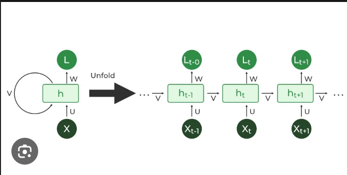
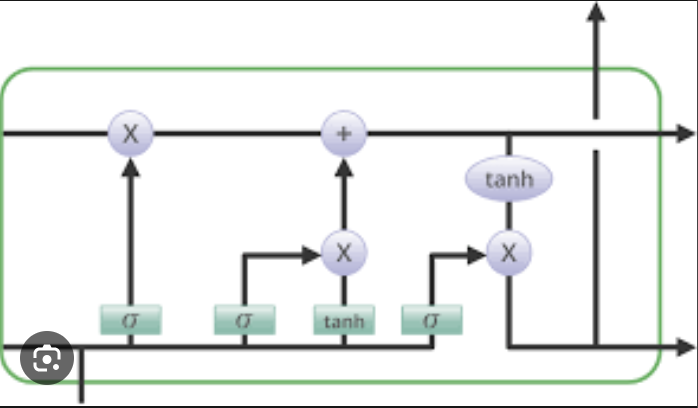

# NATURAL LANGUAGE PROCESSING

- Text classification:
    - Text classification is a machine learning technique that assigns a set of predefined categories to open-ended text. Text classifiers can be used to organize, structure, and categorize pretty much any kind of text – from documents, medical studies and files, and all over the web.
    - Text classification is a natural language processing (NLP) task that involves assigning a category to a piece of text. For example, a text classifier could be used to classify news articles as "politics", "sports", or "entertainment".
    - There are many different ways to perform text classification. One common approach is to use a bag-of-words (BoW) model. A BoW model simply counts the number of times each word appears in a document. These counts can then be used to train a classifier, such as a support vector machine (SVM) or a naive Bayes classifier.
    - Another approach to text classification is to use word embeddings. Word embeddings are a type of representation for words that captures the meaning of the words in a way that computers can understand. Word embeddings can be used to train a classifier that can directly predict the category of a text without having to first count the number of times each word appears in the text.
    - Text classification is a natural language processing (NLP) task in which a machine learning model is trained to categorize text documents into predefined classes or categories. The goal of text classification is to automatically assign a label or class to a given piece of text based on its content and characteristics. This task is widely used in various applications, including email spam detection, sentiment analysis, topic categorization, language identification, and more.
- Semantic analysis:
    - Semantic analysis analyzes the grammatical format of sentences, including the arrangement of words, phrases, and clauses, to determine relationships between independent terms in a specific context.
    - Semantic analysis in Natural Language Processing (NLP) refers to the process of understanding the meaning of text beyond its surface-level representation. It aims to capture the deeper context, intent, and relationships between words and phrases to infer the actual meaning conveyed by the text. Semantic analysis is a more advanced and complex task compared to traditional syntactic analysis, which focuses on the grammatical structure of sentences.
    - Semantic analysis in natural language processing (NLP) is a process of understanding the meaning of text. It is a more advanced task than text classification, which only assigns categories to text. Semantic analysis can be used to understand the meaning of individual words, phrases, and sentences.
- Sentiment analysis:
    - Sentiment analysis, also known as opinion mining, is a natural language processing (NLP) task that involves determining the sentiment or emotion expressed in a piece of text. The goal of sentiment analysis is to automatically classify the sentiment of a given text as positive, negative, neutral, or sometimes more fine-grained emotions like happy, sad, angry, etc. This analysis helps understand the overall sentiment or attitude of the writer or speaker towards a particular topic, product, service, or event.
    - It can also be used to determine the intensity of the sentiment.
- Email spam classifier:
    - An email spam classifier in NLP is a machine learning model that automatically categorizes incoming emails as either "spam" (unwanted or unsolicited messages) or "ham" (legitimate and non-spam messages). The goal of the email spam classifier is to filter out unwanted spam emails and ensure that important and relevant emails reach the user's inbox.
- Sequence models and Transformers:
    - Sequence models:
        - Sequence models are the machine learning models that input or output sequences of data. Sequential data includes text streams, audio clips, video clips, time-series data and etc. Recurrent Neural Networks (RNNs) is a popular algorithm used in sequence models.
        - Sequence models typically have an internal state that is updated as the sequence is processed. This state can be used to capture the context of the sequence, which can be helpful for tasks such as text understanding and machine translation.
        - These models are specifically suited for tasks where the order and context of the elements in the sequence are crucial for understanding the data.
    - Transformers:
        - The key idea behind transformers is self-attention. Unlike traditional sequential models like Recurrent Neural Networks (RNNs), transformers do not process sequences in a strictly sequential manner. Instead, they use self-attention mechanisms to process all elements in the sequence simultaneously and learn to weigh the importance of each element based on its relevance to other elements in the sequence.
        - Transformers are a type of neural network architecture that has been shown to be very effective for a variety of natural language processing (NLP) tasks, including machine translation, text summarization, and question answering. Transformers were first introduced in 2017 by Vaswani et al. in their paper "Attention Is All You Need".
        - Transformers work by using attention mechanisms to learn the relationships between different parts of a sequence. This allows them to capture long-range dependencies in the sequence, which is important for many NLP tasks. Transformers are also very efficient, which makes them well-suited for large-scale NLP tasks.
    
    - RNN(Recurrent neural networks):
        - It is the first algorithm that remembers its input, due to an internal memory, which makes it perfectly suited for machine learning problems that involve sequential data.
        - A recurrent neural network (RNN) is a type of artificial neural network that is specialized for processing a sequence of data. RNNs are able to maintain an internal state that allows them to remember previous inputs, which makes them well-suited for tasks such as natural language processing, speech recognition, and machine translation.
        - RNNs work by repeatedly applying the same set of weights to a sequence of inputs. The output of each step is then fed back into the network as input for the next step. This allows the network to learn the long-term dependencies between the inputs in the sequence.
        - Mathematically, an RNN can be represented as follows:

            ht = f(Wx * xt + Wh * ht-1)
                where:

            - ht is the hidden state at time step t.
            - xt is the input at time step t.
            - ht-1 is the hidden state at the previous time step (t-1).
            -f() is the activation function, usually a non-linear function like the hyperbolic tangent or the rectified linear unit (ReLU).
            - Wx and Wh are weight matrices that the model learns during training.

        However, traditional RNNs can suffer from the vanishing gradient problem, which makes it difficult for them to capture long-term dependencies in the data. To overcome this limitation, variations of RNNs have been developed, such as Long Short-Term Memory (LSTM) networks and Gated Recurrent Units (GRUs). These architectures use gating mechanisms to better control the flow of information and mitigate the vanishing gradient problem, making them more effective in handling long sequences of data.
        - 

    - LSTM
        - LSTM stands for long short-term memory networks, used in the field of Deep Learning. It is a variety of recurrent neural networks (RNNs) that are capable of learning long-term dependencies, especially in sequence prediction problems.
        - It is a type of recurrent neural network (RNN) that is specifically designed to handle sequential data, such as time series, speech, and text.
        - LSTMs work by using a gating mechanism that selectively recalls or forgets information. This allows the model to capture and remember the important context, even when there is a significant time gap between relevant events in the sequence.
        - LSTM stands for Long Short-Term Memory, and it is a type of Recurrent Neural Network (RNN) architecture designed to address the vanishing gradient problem often encountered in traditional RNNs. LSTM networks are particularly effective for handling long sequences of data and have become widely used in various machine learning applications, especially in natural language processing, speech recognition, and time series analysis.
        - The key idea behind LSTM is the use of memory cells and gating mechanisms to control the flow of information within the network. Unlike standard RNNs, which have a single recurrent hidden state, LSTM networks have memory cells that store information over time. These memory cells allow LSTMs to capture long-term dependencies in the data, making them well-suited for tasks that involve sequences of arbitrary length.
        - An LSTM cell typically consists of three main components:

            - Cell State (Ct): The long-term memory that stores information from previous time steps.
            - Input Gate (i_t): Determines what information to update and store in the cell state.
            - Forget Gate (f_t): Decides what information to discard from the cell state.
        - 
        
